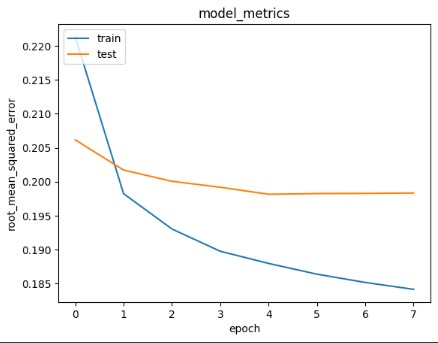

# *Movies Rekomendation*
---
## Domain Proyek

Perkembangan layanan streaming video seperti Netflix, Disney+, dan Amazon Prime membuat jumlah film dan serial TV yang tersedia sangat banyak. Pengguna sering bingung memilih tontonan yang sesuai preferensi mereka. Sistem rekomendasi yang memanfaatkan rating pengguna saja terkadang kurang akurat karena bisa bias dan tidak mempertimbangkan sentimen review serta tren terkini di sosial media. Oleh karena itu, proyek ini bertujuan membangun sistem rekomendasi yang menggabungkan data rating, analisis sentimen review film/series, dan tren sosial media untuk memberikan rekomendasi yang lebih relevan dan up-to-date.

referensi:


*   [Sistem Rekomendasi Film Menggunakan Content Based Filtering](https://j-ptiik.ub.ac.id/index.php/j-ptiik/article/view/9163)
*   [Sistem Rekomendasi Film Menggunakan Metode Hybrid Collaborative Filtering Dan Content-based Filtering](https://openlibrarypublications.telkomuniversity.ac.id/index.php/engineering/article/view/18066)

---
## Business Understanding

### Problem Statements

1. Pengguna kesulitan memilih film yang sesuai dengan selera mereka di platform streaming.
2. Data rating saja tidak cukup untuk memberikan rekomendasi yang relevan karena bisa bias.

### Goals

1. Membangun sistem rekomendasi film yang menggabungkan rating pengguna dan genre movies.
2. Memastikan rekomendasi yang diberikan lebih relevan dengan selera pengguna.

### Solution Approach

1. **Content-Based Filtering**: Menggunakan informasi yang ada di film, seperti genre dan deskripsi, untuk merekomendasikan film yang serupa dengan yang sudah dilihat pengguna.
2. **Collaborative Filtering**: Menggunakan data rating dari pengguna lain untuk memberikan rekomendasi berdasarkan kesamaan preferensi antar pengguna.
---
## Data Understanding

### Deskripsi Dataset

Dataset ini berisi data mengenai 4 data yaitu data tentang Movies, Rating, serta Tag yang telah diisikan oleh User. dengan total movies sebanyak 9742 data, ratings sebanyak 100836 data, dan tags sebanyak 3683 data

### Sumber Dataset
Dataset ini dapat ditemukan di [Grouplens - Movielens](https://grouplens.org/datasets/movielens/).

### Variabel pada Dataset

- **movies.csv**:
  - `movieId`: ID unik untuk setiap film.
  - `title`: Judul film.
  - `genres`: Kategori genre yang dimiliki film, dipisah dengan tanda `|`.
- **ratings.csv**:
  - `userId`: ID unik untuk setiap pengguna.
  - `movieId`: ID film yang diberi rating oleh pengguna.
  - `rating`: Rating yang diberikan pengguna terhadap film (skala 1-5).
  - `timestamp`: Waktu pengguna memberikan rating.
- **tags.csv**:
  - `userId`: ID pengguna yang memberikan tag.
  - `movieId`: ID film yang diberi tag.
  - `tag`: Kata kunci atau tag yang diberikan pengguna.
  - `timestamp`: Waktu pemberian tag.
---
## EDA (Exploratory Data Analysist)

### Exploratory Data Analysis (EDA) Variabel Movies


Variabel `movies` berisi informasi mengenai film-film dalam dataset. Informasi ini menjadi dasar dalam content-based filtering untuk mengidentifikasi kemiripan antar film berdasarkan atribut film.

#### Struktur Data `movies`

- **movieId**: ID unik film.
- **title**: Judul film lengkap termasuk tahun rilis.
- **genres**: Genre film yang dipisah dengan tanda `|`.


#### Statistik dan Pemrosesan


- Total film unik sebanyak **9742**.
- Judul film unik sekitar **9737**.
- Tidak ada data duplikat.
- Genre populer adalah Drama, Comedy, Thriller, Action, Romance, dll.

#### Top Genre


berdasarkan informasi diatas , top 10 genre yang paling banyak ditampilkan :

1.   Drama dengan **4361** movie
2.   Comedy dengan **3756** movie
3.   Thriller dengan **1894** movie
4.   Action dengan **1828** movie
5.   Romance dengan **1596** movie
6.   Adventure dengan **1263** movie
7.   Crime dengan **1199** movie
8.   Sci-Fi dengan **980** movie
9.   Horror dengan **978** movie
10.  Fantasy dengan **779** movie

---

### Exploratory Data Analysis (EDA) Variabel Ratings

Variabel `ratings` berisi data penilaian yang diberikan oleh pengguna terhadap film yang telah mereka tonton. Informasi ini menjadi dasar utama dalam membangun model rekomendasi berbasis collaborative filtering.

#### Struktur Data `ratings`


Dataset `ratings` memiliki kolom-kolom berikut:

- **userId**: Identifikasi unik untuk setiap pengguna.
- **movieId**: Identifikasi unik untuk setiap film yang diberikan rating.
- **rating**: Nilai penilaian yang diberikan, berkisar antara 1 hingga 5.
- **timestamp**: Waktu saat rating diberikan (tidak digunakan dalam pemodelan).

#### Statistik dan Karakteristik Data


- Dataset berisi rating dari **610 pengguna unik**.
- Terdapat rating untuk **9724 film unik**.
- Distribusi rating menunjukkan nilai rata-rata sekitar **3.5**, dengan rentang minimum 1 dan maksimum 5.
- Tidak ditemukan data duplikat pada dataset rating.
- Setiap pengguna memberikan rating pada beberapa film berbeda dan tidak ada pengguna yang memberi rating lebih dari satu kali pada film yang sama.


#### Persebaran Ratings


Persebaran rating menunjukkan bahwa paling banyak movies mendapatkan rating di angka 4 yang mencapai 25.000+ movies, ini menunjukkan bahwa user sebagian besar memberikan penilaian yang baik.

---


### Exploratory Data Analysis (EDA) Variabel Tags

#### Struktur Data `tags`


- **userId**: ID pengguna.
- **movieId**: ID film.
- **tag**: Kata kunci atau frasa deskriptif.
- **timestamp**: Waktu tag diberikan (tidak dipakai dalam pemodelan).

#### Statistik


- Terdapat **58 pengguna unik** yang memberikan tag.
- Tag diberikan untuk **1572 film** dengan total **1589 tag**.
- Pengguna bisa memberikan lebih dari satu tag untuk film yang sama.
- Tidak ada data duplikat pada dataset ini.

---

### Kesimpulan

Analisis EDA pada ketiga variabel utama (`ratings`, `movies`, dan `tags`) memberikan gambaran menyeluruh tentang data yang digunakan dalam sistem rekomendasi. Variabel `ratings` menyediakan interaksi pengguna-film sebagai dasar collaborative filtering. Variabel `movies` memberikan atribut film penting untuk content-based filtering. Sedangkan variabel `tags` memperkaya fitur dengan deskripsi tambahan dari pengguna. Semua variabel ini dipersiapkan secara menyeluruh melalui preprocessing agar dapat digunakan secara optimal dalam pemodelan rekomendasi.

## Data Preparation

### Movies Variable

#### 1. Memisahkan value genre kedalam bentuk list

```
# Memisahkan genres kedalam daftar list

movies['genres_list'] = movies['genres'].str.split('|')

```
Hasil : 


`genre` dipisahkan menjadi dalam bentuk **list**

#### 2. Memisahkan Title dan Year

```

movies['year'] = movies['title'].str.extract(r'\((\d{4})\)', expand=False)
movies['title'] = movies['title'].str.replace(r'\s*\(\d{4}\)', '', regex=True).str.strip()

```
Hasil: 


Tahun rilis diekstrak dari kolom `title` menggunakan regular expression untuk menangkap angka tahun dalam tanda kurung, contohnya `(1995)`.  
Judul film kemudian dibersihkan dari tahun agar menjadi teks yang lebih bersih dan mudah diproses.

#### 3. Memberikan nilai kosong pada kolom 'year'

```
movies['year'] = movies['year'].fillna(0).astype(int)

```


Film yang tidak memiliki informasi tahun akan diisi dengan nilai `0` sebagai placeholder agar tipe data tahun konsisten dalam bentuk integer.


### Ratings Variable

#### 1. Drop kolom timestamp

```

ratings = ratings.drop(['timestamp'], axis=1)

```
Hasil:


- Kolom `timestamp` yang tidak relevan untuk pemodelan dihapus.

### Tags Variable

#### 1. Menggabungkan tag yang diberikan user pada movies yang sama menjadi list String


Fungsi diatas untuk mengetahui apakah `users` dapat memberikan `tags` pada `movies` yang sama lebih dari satu atau tidak (unique).
hasil menunjukkan bahwa `max()` mendapati nilai **173**, hal ini menunjukkan bahwa `users` dapat memberikan `tags` lebih dari 1 pada `movies` yang sama.


```

tags_agg = tags.groupby(['userId', 'movieId'])['tag'].apply(lambda x: ','.join(x.unique())).reset_index()

```

Hasil : 


Hasil diatas pada kolom `tags` memuat kumpulan `tag` yang diberikan `users` pada `movies` yang sama dalam bentuk list String.

#### 2. Memberikan nilai missing value pada kolom Tag

```
tags_agg['tag'] = tags_agg['tag'].fillna('no_tag')
```
Hasil :


---

### Menggabungkan *ratings* dengan *tags*

```

ratings_tags = pd.merge(ratings, tags_agg, on=['userId', 'movieId'], how='left')
ratings_tags['tag'] = ratings_tags['tag'].fillna('no_tag')

```

Hasil:


Code diatas menggabungkan 2 df yaitu `ratings` dan `tags_agg` menjadi satu df dengan kunci yaitu **userId** dan **movieId** left join (**mempertahankan df sebelah kiri (ratings)**), kemudian mengisi missing value kolom `tags`, `movie` yang tidak memiliki nilai `tag` dengan **no_tag**


### Menggabungkan All Data

```

full_data = pd.merge(ratings_tags, movies, on='movieId', how='left')


```
Hasil:


Hasil diatas menggabungkan 3 df yaitu `ratings_tags` dan `movies` dengan kunci `movieId` left join (**mempertahankan df sebelah kiri (ratings_tags)**)

### Data Preparation untuk Content-Based Filtering (CBF)

**Content-Based Filtering** memanfaatkan fitur yang ada pada film, seperti tag, untuk menghitung kemiripan antar film.

#### 1. Persiapan Data Tags


##### Pengabungan Tag menjadi Satu String

```
def clean_and_join_tags(tag_lists):
    """
    Menerima Series yang berisi list tag per film dari beberapa user,
    menggabungkan tag menjadi string, dan melewati tag 'no_tag'.
    """
    cleaned_tags = []
    for tags in tag_lists:
        # Pastikan tags adalah list, jika tidak buat list kosong
        if isinstance(tags, list):
            # Filter hapus 'no_tag'
            filtered = [tag.strip() for tag in tags if tag.strip().lower() != 'no_tag']
            cleaned_tags.extend(filtered)
    # Gabungkan menjadi satu string
    if len(cleaned_tags) == 0:
        return ''  # jika tidak ada tag selain no_tag
    return ' '.join(cleaned_tags)

tags_per_movie = full_data.groupby('movieId')['tag'].apply(clean_and_join_tags).reset_index()
```

`tags_per_movie` digunakan untuk menggabungkan seluruh `tag` pada `movie` yang sama kedalam satu string, lalu memberikan nilai default **no_tag** pada data `tag` yang kosong. 

##### TF-IDF

```
tfidf_vectorizer = TfidfVectorizer(stop_words='english', max_features=1000)
tfidf_matrix = tfidf_vectorizer.fit_transform(tags_per_movie['tag'])
```
TF-IDF digunakan untuk mengubah data `tag` menjadi matriks vektor yang dapat digunakan dalam pemodelan CBF. Matriks vektor ini akan digunakan sebagai fitur atribut film dalam CBF. dengan menambahkan parameter `stop_words='english'` dan `max_features=1000` untuk menghilangkan kata-kata yang tidak memiliki makna dan mengambil 1000 fitur tertinggi.

#### 2. Encoding Genre

```
mlb = MultiLabelBinarizer()
genres_encoded = mlb.fit_transform(full_data['genres_list'])

# Membuat dataframe hasil encoding genre
genres_df = pd.DataFrame(genres_encoded, columns=mlb.classes_, index=full_data.index)
full_data = pd.concat([full_data, genres_df], axis=1)
full_data.drop(columns=['genres_list'], inplace=True)
```
Menerapkan One Hot Encoding pada kolom `genre_list` yang akan digabung dalam `tag` untuk Content-Based Filtering


#### 3. Menggabungkan Genre dan Tag

```
genres_df_with_movieId = full_data[['movieId']].reset_index(drop=True).join(genres_df)

genres_aligned_with_tags = pd.merge(tags_per_movie[['movieId']], genres_df_with_movieId.drop_duplicates(subset=['movieId']), on='movieId', how='left')

genres_aligned_values = genres_aligned_with_tags.drop(columns=['movieId']).values

genres_aligned_values = np.nan_to_num(genres_aligned_values)


combined_features = np.hstack([genres_aligned_values, tfidf_matrix.toarray()])
```

Fungsi diatas menggabungkan `genres` dengan `tags_per_movies` yang akan digunakan pada **Cosinus Similarity**


### Data Preparation untuk Collaborative Filtering (CF)

**Collaborative Filtering** menggunakan rating pengguna untuk mengidentifikasi film yang disukai oleh pengguna dengan preferensi serupa.

#### 1. Mengacak Data

```
df_rating = df_rating.sample(frac=1, random_state=42)
```
Dengan menggunakan parameter `frac=1` dan `random_state=42` mengacak data rating untuk menghindari pengaruh dari pengguna yang memiliki rating yang banyak

#### 2. Normalisasi Rating

```
min_rating = df_rating['rating'].min()
max_rating = df_rating['rating'].max()

# Membuat variabel x untuk mencocokkan data user dan movie menjadi satu value
x = df_rating[['userId', 'movieId']].values

# Membuat variabel y untuk membuat rating dari hasil
y = df_rating['rating'].apply(lambda x: (x - min_rating) / (max_rating - min_rating)).values
```


#### 3. Data Split

```
train_indices = int(0.8 * df_rating.shape[0])
x_train, x_val, y_train, y_val = (
    x[:train_indices],
    x[train_indices:],
    y[:train_indices],
    y[train_indices:]
)
```

Dataset dibagi menjadi data *training* dan *testing* dengan rasio **80%** untuk training dan **20%** untuk testing. Ini memungkinkan model untuk belajar pada data yang lebih besar dan menguji performa pada data yang belum terlihat.


#### 4. Mapping User dan Movie

```
# Mapping userId dan movieId ke indeks embedding
user_ids = df_rating['userId'].unique().tolist()
user_to_index = {user_id: index for index, user_id in enumerate(user_ids)}
index_to_user = {index: user_id for index, user_id in enumerate(user_ids)}

movie_ids = df_rating['movieId'].unique().tolist()
movie_to_index = {movie_id: index for index, movie_id in enumerate(movie_ids)}
index_to_movie = {index: movie_id for index, movie_id in enumerate(movie_ids)}
```

Mapping userId dan movieId ke indeks numerik diperlukan agar bisa digunakan dalam layer embedding di model neural network.


## Modelling

### Content - Base Filtering

#### Cosines Similarity

```
# Hitung cosine similarity berdasarkan fitur gabungan
cosine_sim_combined = cosine_similarity(combined_features, combined_features)
```

Menghitung Cosine Similarity antara setiap baris (movie) dalam matrix TF-IDF. Cosine Similarity digunakan untuk mengukur kemiripan antara dua vektor. Dalam konteks ini, kita ingin menemukan movie yang mirip dengan movie lainnya berdasarkan *tags* mereka.

Cosine Similarity mengukur kemiripan antara dua vektor berdasarkan sudut (bukan panjangnya).

Nilai berada di antara `-1` hingga `1`:

`1` → sangat mirip (arah vektor sama)

`0` → tidak mirip (tegak lurus)

`-1` → berlawanan (jarang terjadi di NLP)

**Rumus Cosine Similarity**

```math
\text{cosine\_similarity}(A,B) = \frac{A \cdot B}{\|A\| \times \|B\|}
````

Keterangan:
- $ A \cdot B $: dot product antara vektor A dan B  
- $ \|A\| $: panjang (norma) dari vektor A  
- $ \|B\| $: panjang (norma) dari vektor B

#### Inferensi


Fungsi tersebut menghasilkan 5 rekomendasi terbaik berdasarkan kombinasi `tag` dan `genre` 


### Collaborative Filterring

#### Mendefinisikan Model Neural Network Embedding

```
class RecommenderNet(tf.keras.Model):
  def __init__(self, num_users, num_movies, embedding_size, **kwargs):
    super(RecommenderNet, self).__init__(**kwargs)
    self.user_embedding = layers.Embedding(
        num_users,
        embedding_size,
        embeddings_initializer='he_normal',
        embeddings_regularizer=keras.regularizers.l2(1e-6)
    )
    self.user_bias = layers.Embedding(num_users, 1)
    self.movies_embedding = layers.Embedding(
        num_movies,
        embedding_size,
        embeddings_initializer='he_normal',
        embeddings_regularizer=keras.regularizers.l2(1e-6)
    )
    self.movies_bias = layers.Embedding(num_movies, 1)

  def call(self, inputs):
    user_vector = self.user_embedding(inputs[:, 0])
    user_bias = self.user_bias(inputs[:, 0])
    movies_vector = self.movies_embedding(inputs[:, 1])
    movies_bias = self.movies_bias(inputs[:, 1])
    dot_user_movies = tf.tensordot(user_vector, movies_vector, 2)
    x = dot_user_movies + user_bias + movies_bias
    return tf.nn.sigmoid(x)
```
**Embedding Layer**:

self.user_embedding: Mewakili pengguna dalam ruang dimensi rendah (embedding).

self.movies_embedding: Mewakili film dalam ruang dimensi rendah.

**Bias**:

self.user_bias dan self.movies_bias: Mewakili bias bagi masing-masing pengguna dan film, untuk menyesuaikan prediksi model.

**Dot Product**:

Menghitung dot product antara vektor embedding pengguna dan film untuk menghitung kemiripan dan prediksi rating.

Model ini dilatih menggunakan binary cross-entropy loss dan dioptimalkan dengan Adam optimizer. Fungsi aktivasi sigmoid digunakan untuk menghasilkan output rating antara 0 dan 1.

#### Compile dan Training Model

```
model = RecommenderNet(num_users, num_movies, 50)

model.compile(
    loss=tf.keras.losses.BinaryCrossentropy(),
    optimizer=keras.optimizers.Adam(learning_rate=0.001),
    metrics=[tf.keras.metrics.RootMeanSquaredError()]
)

earlystopping = EarlyStopping(monitor='val_loss', patience=5, restore_best_weights=True)
checkpoint = ModelCheckpoint('best_model.h5', save_best_only=True)

history = model.fit(
    x=x_train,
    y=y_train,
    batch_size=8,
    epochs=100,
    callbacks=[earlystopping, checkpoint],
    validation_data=(x_val, y_val)
)
```

Model dilatih menggunakan loss binary crossentropy dengan optimizer Adam. RMSE digunakan sebagai metrik evaluasi.

Menggunakanan parameter *callback*

EarlyStopping: Menghentikan pelatihan jika model tidak menunjukkan peningkatan pada data validasi, untuk menghindari overfitting.

ModelCheckpoint: Menyimpan model terbaik selama pelatihan.

#### Visualisasi



Visualisasi ini memperlihatkan bahwa model collaborative filtering yang dikembangkan berhasil belajar dengan baik pada data training dan tetap mempertahankan performa yang konsisten pada data testing. Dengan demikian, model ini dapat diandalkan untuk memprediksi rating film pada pengguna baru secara efektif.


#### Inferensi


Berdasarkan hasil rekomendasi diatas, model sudah bisa memberikan rekomendasi berdasarkan movie yang diberikan rating oleh user.

## Evaluasi

### Content-Based Filtering


Pada pendekatan **Content-Based Filtering (CBF)** yang menggunakan **tag** dan **genre** sebagai acuan untuk rekomendasi, evaluasi dilakukan dengan metrik **Precision@K**. Evaluasi ini bertujuan untuk mengukur kualitas rekomendasi film yang diberikan oleh sistem.

**Precision@5** mengukur seberapa banyak rekomendasi yang relevan di antara 5 rekomendasi teratas yang diberikan oleh sistem. 
##### Formula Precision@5:

$$
\text{Precision@5} = \frac{\text{Jumlah rekomendasi relevan}}{5}
$$

Hasil rekomendasi: 5 Movies

Mengandung Genre Sesuai ( Adventure|Animation|Children|Comedy|Fantasy) : 5 Movies

Precision = 5/5 = 100%

Maka dinyatakan model dapat memberikan Rekomendasi sesuai dengan Genrenya.

### Collaborative Filtering


#### 1. **RMSE pada Data Testing**

Pada proses evaluasi data testing, RMSE dihitung untuk mengukur performa model pada data yang tidak dilihat selama pelatihan (data baru). 

- Nilai RMSE sebesar **0.2298** menunjukkan bahwa rata-rata kesalahan antara rating yang diprediksi dan rating yang sebenarnya pada data testing adalah sekitar **0.2298**.
- Nilai ini cukup baik karena semakin kecil nilai RMSE, semakin akurat model dalam memprediksi rating yang sebenarnya.

#### 2. **RMSE pada Data Training**


Nilai RMSE sebesar **0.2459** menunjukkan bahwa rata-rata kesalahan prediksi pada data training adalah 0.2459.

### Kesimpulan
Perbedaan RMSE antara data training **(0.2459**)** dan data testing **(0.2298)** menunjukkan bahwa model memiliki sedikit overfitting, karena RMSE pada data testing lebih kecil daripada pada data training. Ini bisa berarti model telah terlatih dengan sangat baik pada data training, tetapi sedikit lebih kesulitan dalam menggeneralisasi pada data baru.

